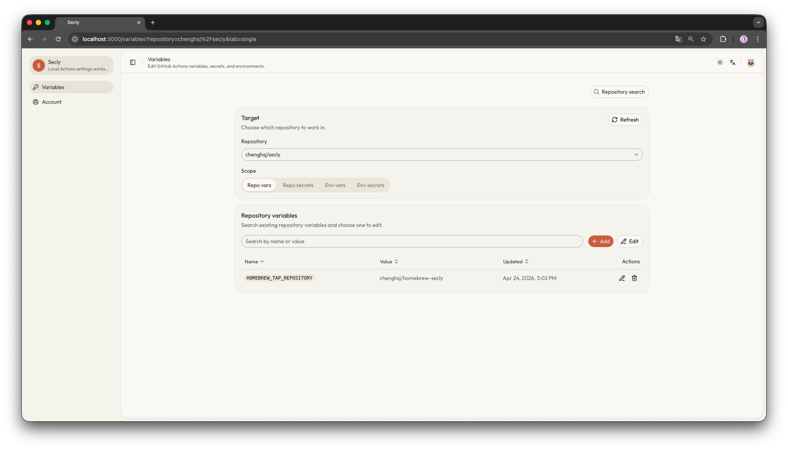

# Secly

Secly is a local-first macOS tool for managing GitHub Actions variables, secrets, and environments from a local web UI and CLI.

Secly uses your local GitHub CLI session instead of managing its own OAuth token.

## Requirements

- macOS
- GitHub account with access to the repositories you want to manage
- GitHub CLI (`gh`)
- Node.js 20+ and npm only if you want to run Secly from source

## Install

### Homebrew

```bash
brew tap chenghsj/secly
brew install secly
```

Start Secly with:

```bash
secly ui
```

### From source

If you want to run Secly directly from this repository:

```bash
npm install
npm run ui
```

`npm install` runs Secly's local install flow automatically. If `~/.local/bin` is on your `PATH`, you can also launch it with:

```bash
secly ui
```

If you need to recreate the local shim after moving the repository, run:

```bash
secly install --force
```

## Upgrade

If you installed Secly with Homebrew:

```bash
brew update
brew upgrade secly
```

If you run Secly from a source checkout:

```bash
git pull
npm install
```

## First Run

- `secly ui` starts the local UI on port `43127` by default.
- The browser opens automatically unless you pass `--no-open`.
- If port `43127` is already in use, Secly fails immediately instead of picking another port.
- On first launch, Secly creates local runtime state under `~/Library/Application Support/secly`.
- If GitHub CLI is not authenticated yet, use the `/connect` flow in the UI or run `secly login`.

Useful options:

```bash
secly ui --no-open
secly ui --port 44000
secly ui --rebuild
```

## Variables Screen

Choose a repository, switch scope, and manage repository or environment settings from one screen.



## What You Can Do

- Launch the local web UI for repository and environment settings
- Reuse your local `gh` session for authentication
- List repositories you can manage from the CLI
- Create, update, and delete repository variables from the CLI
- Manage repository and environment variables and secrets from the web UI
- Lock individual entries locally to prevent accidental edits or deletes

## Entry Locking

Lock any variable or secret locally to prevent accidental edits or deletes. Lock state is stored in the local SQLite database and works across all four scopes. Orphaned locks are cleaned up automatically when the locked entry no longer exists on GitHub.

## CLI

```bash
secly ui
secly login
secly status
secly paths
secly uninstall
secly repos list
secly vars list owner/repo
secly vars set owner/repo NAME VALUE
secly vars delete owner/repo NAME
```

Notes:

- `secly login` delegates to GitHub CLI and reuses your local `gh` session.
- `secly status` prints local install state and GitHub CLI auth status.
- `secly paths` prints the local directories Secly uses.

## Troubleshooting

- If `secly ui` says GitHub CLI is not authenticated, run `secly login` or complete the `/connect` flow in the UI.
- If a repository does not appear in the UI, confirm the current `gh` account can access it and that the login includes the `workflow` scope.
- If port `43127` is already in use, run `secly ui --port <port>` with another free port.
- If `secly` is not found after a source install, make sure `~/.local/bin` is on your `PATH`, then rerun `secly install --force` if needed.

## Uninstall

`secly uninstall --force` removes Secly-managed local state under your home directory. It does not delete a source checkout.

If you installed Secly through Homebrew, also run:

```bash
brew uninstall secly
brew cleanup secly
```

If you no longer want the tap on your machine:

```bash
brew untap chenghsj/secly
```

Useful options:

```bash
secly uninstall --dry-run
secly uninstall --force
```

## Data Locations

- Runtime data: `~/Library/Application Support/secly`
- Optional local shim from a source checkout: `~/.local/bin/secly`

## Development

For source development, project structure, packaging, and release workflows, see [docs/development.md](docs/development.md).
